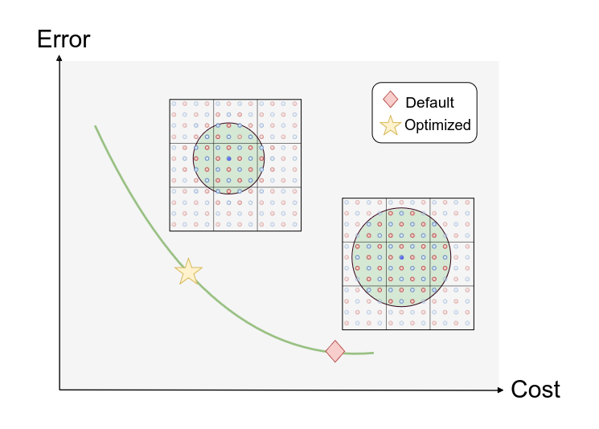

<h2 align="center">Flexible Cutoff Learning</h2>
<p align="center"> Optimizing Machine Learning Potentials After Training </p>

<p align="center">
  <strong><a href="https://iopscience.iop.org/article/10.1088/2632-2153/ae9239">Article</a></strong>  
</p>


This repo contains `flexcut`, a slim python package for training and finetuning MLIPs with `Flexible Cutoff Learning`[1]. It can be installed from the repository root:

```bash
pip install -e .[mace]
```

## Flexible Cutoff Learning 

Flexible Cutoff Learning (FCL) is a training method for machine learning interatomic potentials (MLIPs) that enables post-training adjustment of cutoff radii by randomly sampling cutoffs during training. Using a differentiable cost model, the cutoffs can be optimized for specific target systems after training, allowing application-specific accuracy-cost tradeoffs without retraining.

Currently, only the `MACE` architecture [2] is supported. 
For more information, see [our article](https://iopscience.iop.org/article/10.1088/2632-2153/ae9239). Note: The code used for the paper is part of an internal package. This repo contains a faithful reimplementation of FCL. 

<h2 align="center"></h2>


## Overview

The training code is based on PyTorch Lightning and supports: 

    1. Training from scratch 
    2. Finetuning 
    3. Flexible Cutoff Learning 

The project structure is as follows: 

- `src` contains the source code for training, finetuning and flexible cutoff learning 
- `examples/mace` contains code for training a MACE model on the `MAD 1.0` dataset [3] from scratch, followed by a FCL stage (including optimization of per-element cutoff radii)
- `MAD-data` contains code for converting the original `MAD 1.0` dataset. Executing these scripts is required for running the examples. 

### Augmenting ScaleShiftMACE for Flexible Cutoffs

This repo implements `CutoffFlexibleScaleShiftMACE`, which augments the original `ScaleShiftMACE` by introducing a `FlexibleRadialEmbeddingBlock`: It replaces the radial embedding with a post-processing neural network that takes the cutoff radius per edge as input, enabling the model to adapt its interaction range dynamically.

A trained FCL model (see `examples/mace`) can be evaluated with different cutoff radii by loading the saved model and passing a `flexible_cutoff_per_node` tensor in the forward pass:

```python
model = torch.load("fcl_wrapper.pt")
data = {...}  # your data dictionary
data["flexible_cutoff_per_node"] = torch.tensor([4.0, 5.0, ...])  # per-atom cutoffs
output = model(data, compute_force=True)
```

The `CutoffFlexibleScaleShiftMACE.forward` method accepts all the same arguments as the original MACE model, plus the requirement of a `flexible_cutoff_per_node` tensor in the input data dictionary.

## Example: FCL for MACE foundation models

After pretraining a foundation model with a fixed cutoff, a `MACE` foundation model can be trained with FCL as follows:

```python
import torch
import pytorch_lightning as pl
from flexcut import (
    MACEWrapper,
    SampleFlexibleCutoff,
    ElementwiseFlexibleCutoff,
    load_dataset,
)
from flexcut import EnergyTask, ForcesTask, MlipLightningModule
from torch.optim.lr_scheduler import ReduceLROnPlateau
from torch_geometric.loader import DataLoader

# largest cutoff radius encountered during training
RMAX = 7.0

# Load pretrained foundation model
model = MACEWrapper.load_from_pretrained(
    "foundation.model",
    r_max=RMAX,
)

# Prepare datasets with flexible cutoffs
train_dataset = load_dataset(
    "train.hdf5",
    cutoff=RMAX,
    transforms=[SampleFlexibleCutoff(low=3.5, high=RMAX)],
)
val_dataset = load_dataset(
    "val.hdf5", cutoff=RMAX, transforms=[ElementwiseFlexibleCutoff({1: 4.0, 8: 4.0})]
)

train_loader = DataLoader(train_dataset, batch_size=50, shuffle=True)
val_loader = DataLoader(val_dataset, batch_size=50, shuffle=False)

# Build training module
optimizer = torch.optim.AdamW(model.parameters(), lr=1e-3, weight_decay=1e-8)
scheduler = ReduceLROnPlateau(optimizer, mode="min", factor=0.5, patience=20)
lightning_module = MlipLightningModule(
    model=model,
    optimizer=optimizer,
    scheduler=scheduler,
    tasks=[
        EnergyTask(loss_fn=torch.nn.L1Loss(), loss_weight=0.1),
        ForcesTask(loss_fn=torch.nn.L1Loss(), loss_weight=1.0),
    ],
)

# Train with flexible cutoffs
trainer = pl.Trainer(max_epochs=500, callbacks=[...])
trainer.fit(
    lightning_module, train_dataloaders=train_loader, val_dataloaders=val_loader
)

# Save flexible wrapper
torch.save(lightning_module.model, "fcl_wrapper.pt")
``` 

## Citations

- [1] Flexible Cutoff Learning: 
    ```
    @article{FCL_2026,
    author  = {Oerder, Rick and Hamaekers, Jan},
    title   = {Flexible Cutoff Learning: Optimizing machine learning potentials after training},
    journal = {Machine Learning: Science and Technology},
    doi     = {10.1088/2632-2153/ae9239},
    year    = {2026}
    }
    ```


- [2] MACE:
    ```
    @inproceedings{Batatia2022mace,
    title={{MACE}: Higher Order Equivariant Message Passing Neural Networks for Fast and Accurate Force Fields},
    author={Ilyes Batatia and David Peter Kovacs and Gregor N. C. Simm and Christoph Ortner and Gabor Csanyi},
    booktitle={Advances in Neural Information Processing Systems},
    editor={Alice H. Oh and Alekh Agarwal and Danielle Belgrave and Kyunghyun Cho},
    year={2022},
    url={https://openreview.net/forum?id=YPpSngE-ZU}
    }
    ```


- [3] MAD 1.0 Dataset: 
    ```
    @misc{Mazitov2025,
    author = {Mazitov, Arslan and Chorna, Sofiia and Fraux, Guillaume and Bercx, Marnik and Pizzi, Giovanni and De, Sandip and Ceriotti, Michele},
    title = {Massive Atomic Diversity: a compact universal dataset for atomistic machine learning},
    publisher = {Materials Cloud Archive},
    year = {2025},
    number = {2025.146},
    doi = {10.24435/materialscloud:ab-y2},
    url = {https://doi.org/10.24435/materialscloud:ab-y2}
    }
    ```

